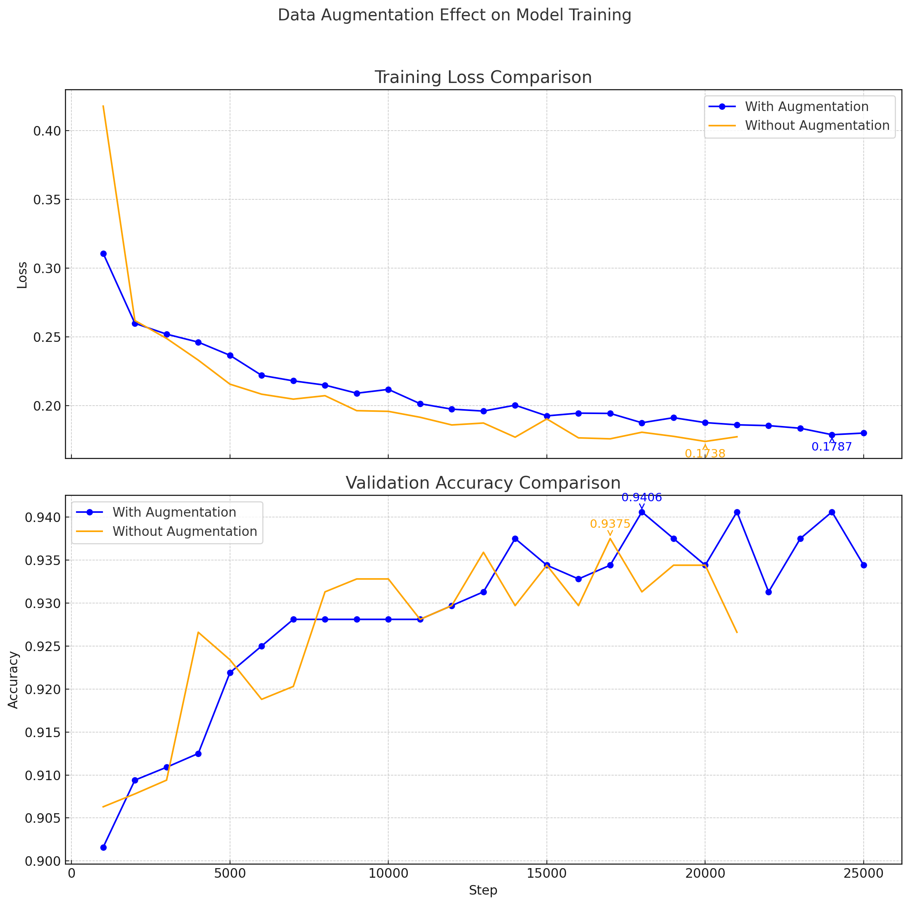
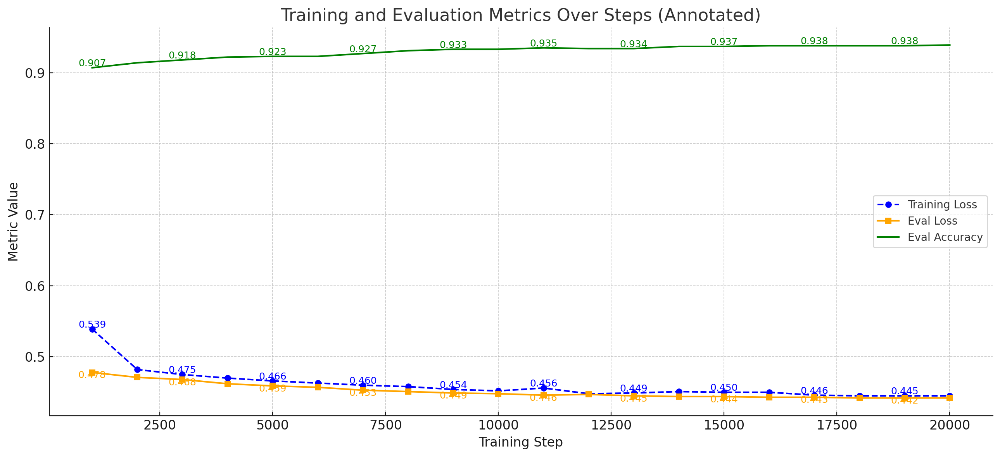

# DL-project2-Finetuning-with-LoRA

## Code

Our code can be found at <u>**notebooknew.ipynb**</u>

## Team Members
- Yucheng Zhao
- Zhiding Zhou
- Airu Liu

## Project Overview
This project implements fine-tuning with LoRA (Low-Rank Adaptation) technique for efficient model adaptation. We explored data augmentation and knowledge distillation to improve model performance while keeping the parameter count low.

## Key Results

### Training Parameters
Total trainable parameters: 884,736

### Test Accuracy
94.06% on validation set
85.475% on kaggle public test set
84.825% on kaggle private test set

## Training Curves

### Data Augmentation Comparison

*Figure 1: Training curves before and after data augmentation*

### Knowledge Distillation Results

*Figure 2: Training curves after knowledge distillation*

## Implementation Details
- Used LoRA for parameter-efficient fine-tuning
- Implemented layer-wise learning rate decay
- Applied early stopping with patience of 3
- Utilized gradient checkpointing for memory efficiency
